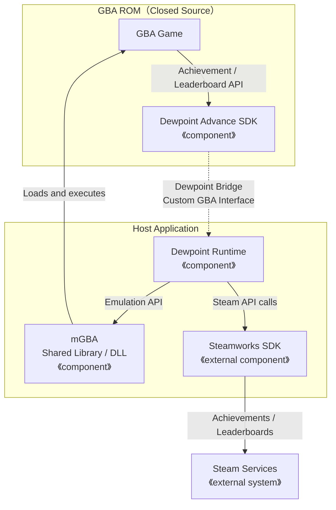

# **WIP:** Dewpoint Advance

Dewpoint Advance (DPA) は、**自作の GBA ソフト** を Steam で頒布する目的に特化したエミュレータフロントエンドです。

エミュレータコアには mGBA を用いています。

そして、GBA ソフトで Steamworks SDK（Leaderboard や Achievement など）と連携する機能、アプリ制御機能のインタフェースを提供する SDK を提供します。

現状、Steam上では過去のコンシューマゲーム機向けソフトをエミュレータで動かすものが多くありますが、それらは in-game と UI を分離する実装になっていることが多いです。しかし、DPAを用いることで「in-game のみでシームレスなプラットフォーム連携」が実現できます。（out-game UI を実装する必要がなくなり生産性とUXに寄与）



なお、本SDKのAPIを用いた GBA ソフトは実機 GBA 上では動作できません。

**本SDKは「既存GBAソフトを動かすこと」が目的ではありません。**

**新規で開発するGBAソフト** をSteamで手軽に配信したいデベロッパー/パブリッシャー向けの SDK です。

**重要な補足事項:**

- GameBoy および GameBoy Advance は任天堂の日本またはその他地域における登録商標です。ゲーム名に「for XXX」等をつけたい場合は任天堂からの許諾が必要になります。（ゲーム名 Advance 等の商標権を侵害しない命名を推奨します）
- GameBoy または GameBoy Advance の BIOS 機能（MP2k等）は使用しないでください。
- ROM ファイルに GameBoy または GameBoy Advance のヘッダー画像に任天堂が商標権や意匠権を有するデータは自動的にマスク処理されます。

## WIP status

- [x] macOS Runtime (macOS + SDL2 で GBA のゲームを動かす)
- [ ] Linux Runtime (Linux + SDL2 で GBA のゲームを動かす)
- [ ] Windows Runtime (Windows + DirectX で GBA のゲームを動かす)
- [x] SDK: Replay API for GBA (GBA上で利用できるリプレイデータを保持/読み込みできるAPI)
- [x] SDK: Achievement API for GBA (GBA上で利用できるアチーブメント・アンロックAPI)
- [x] SDK: Leaderboard API for GBA (GBA上で利用できるリーダーボード送信/受信API)
- [ ] パッケージ作成手順の実装 (Windows)
- [ ] パッケージ作成手順の実装 (macOS)
- [ ] パッケージ作成手順の実装 (Linux)
- [x] ライセンス精査
- [x] リポジトリのpublic化

## How to Use

### Pre-request

1. Valve と Steam 配信契約を締結
2. Steamworks SDK を入手
3. [./steamworks](./steamworks/) ディレクトリ以下に `public` および `redistributable_bin` ディレクトリを配置

### Build for Test

```bash
git clone https://github.com/suzukiplan/dewpoint-advance
cd dewpoint-advance
cp package.conf.model package.conf
make
```

### Execute

```bash
./game
```

- カーソルキー: D-pad
- Z: Bボタン
- X: Aボタン
- A: Lボタン
- S: Rボタン
- Esc: Selectボタン
- Space: Startボタン
- ⌘+R: リセット
- ⌘+Q: 電源OFF

## Dewpoint SDK

- [devkitPro](https://github.com/devkitPro/) で作成したGBAのプロジェクトに利用できます。
- ソースコードディレクトリに [./sdk/](./sdk/) 以下のファイルをコピーしてください。
- `#include "dpa.h"` で使用できます。

| API | Description |
|:----|:------------|
| `dpa_is_enabled` | Dewpoint Advance SDK が利用できるかチェック |
| `dpa_get_app_version` | アプリバージョン（AppVersion）の文字列を取得 |
| `dpa_achievement_unlock` | アチーブメントをアンロック |
| `dpa_leaderboard_send` | スコアを送信 |
| `dpa_leaderboard_ready` | リーダーボードからエントリが取得可能か確認 |
| `dpa_leaderboard_get` | リーダーボードからTop100のエントリを取得 |
| `dpa_leaderboard_getm` | リーダーボードから自分のエントリを取得 |
| `dpa_ugc_clear` | UGC データをクリア |
| `dpa_ugc_append` | UGC に 4bytes のデータを追加 |
| `dpa_ugc_download` | UGC データのダウンロードを開始 |
| `dpa_ugc_size` | UGC データのサイズ取得（ダウンロード完了確認） |
| `dpa_ugc_read` | UGC データを 4bytes 読み込む |
| `dpa_fullscreen_set` | フルスクリーン / ウィンドウの切り替え|
| `dpa_fullscreen_get` | フルスクリーン / ウィンドウの状態取得|
| `dpa_exit` | プロセス停止（実機ではハングアップ）|

詳細な仕様は [./sdk/dpa.h](./sdk/dpa.h) の実装をチェックしてください。

> devkitPro を用いたゲーム開発には [GBA SDK for port from VGS-Zero](https://github.com/suzukiplan/gbasdk) などが便利です。

## Steamworks Settings

### Steam Cloud

Steamworks 設定の「アプリケーション」→「Steam クラウド」に次の設定をしてください:

__Steam クラウド設定:__

- ユーザーごとのバイトクォータ: `4194304`
- ユーザーごとに許可されるファイル数: `32`

上記設定基準は参考です。

- Dewpoint Advance では、save.dat（SRAM/Flash/EEPROM）、config.dat（ウィンドウ状態）、リプレイx16ボードで最大18ファイルをSteamクラウドに保存しますが、余裕をもって32個に設定しておけば安心です。
- リプレイのデータサイズは 1フレーム 4bytes で 60分（216,000フレーム）記録する場合、最大 864,000 バイトと計算できます。（※Dewpoint Advance SDKのリプレイAPIはネイティブメモリに記録されるためGBA側のRAMを使いません）

__Steam 自動クラウド設定:__

- `save.dat` (SRAM/Flash/EEPROM)
  - ルート: `アプリのインストールディレクトリ`
  - サブディレクトリ: `save`
  - パターン: `save.dat`
  - OS: `全てのOS`
- `config.dat` (ウィドウモード、ウィンドウサイズ、ウィンドウ位置など)
  - ルート: `アプリのインストールディレクトリ`
  - サブディレクトリ: `save`
  - パターン: `config.dat`
  - OS: `全てのOS`

### Steam Input

Steamworks 設定の「アプリケーション」→「Steam 入力」に次の設定をしてください:

- コントローラにSteam入力を選択: `Xbox`, `PlayStation`, `Nintendo Switch` をチェック
- Steam入力デフォルトコントローラ設定: `カスタム設定`
- マニフェストファイルパス: `action_manifest.vdf`

GameBoy Advance の各ボタン（d-pad, A, B, Start, Select, L, R）の役割は package.conf を適宜編集してください。

なお、Xbox, PlayStation, Nintendo Switch のボタンアサインは次のように割り当てられます。

| Xbox | PlayStation | Nintendo Switch | GBA          |
|:----:|:-----------:|:---------------:|:------------:|
| d-pad| d-pad       | d-pad           | d-pad        |
| A    | ×           | A               | A            |
| B    | ○           | B               | B            |
| X    | ◻︎           | X               | B            |
| Y    | △           | Y               | A            |
| Menu | Menu        | plus            | Start        |
| View | Share       | minus           | Select       |
| LB   | L1          | L               | L            |
| RB   | R1          | R               | R            |
| LT   | L2          | ZL              | L            |
| RT   | R2          | ZR              | R            |
| LS   | L3          | L3              | L            |
| RS   | R3          | R3              | R            |

このデフォルト割り当ては [./vdf/action_manifest.vdf](./vdf/action_manifest.vdf) を編集することで変更できます。

各自のゲームに適したアサインをしてください。

### Steam Leaderboard

Steamworks 設定の「データ＆実績」→「ランキング」に次のボードを追加してください:

- 名前: `board0`, `board1`, `board2` ... `board15` (最大16ボード)
  - 単一のリーダーボードしか使用しない場合は `board0` だけでも問題ありません
- ユーザーの前後の範囲: `0`
- グローバルランキング上限: `100`

上記以外の設定は任意です。

Dewpoint Advance SDK では、Top 100 のランキングデータと自分のランキングデータを取得できます。（※自分の周辺ランキングを取得するインタフェースはありません）

> _NOTE: Dewpoint SDK で Leaderboard を使用しない場合、この設定は不要です。_

なお、ランキングのレンジ仕様については、私が把握している各プラットフォーム仕様の最小公約数をハードリミットに設定していますが、保証はありません。

また、Dewpoint Advance の UGC データ（スコアランキング添付データ）は、Steam では標準サポートされていますが、一部のコンソール（任天堂スイッチなど）のネットワーク機能では提供されていません。

その他のプラットフォームへ Dewpoint Runtime を移植する際は、各プラットフォームの規定に従って適宜仕様を調整してください。

### Steam Achievement

Steamworks 設定の「データ＆実績」→「実績」に `dpa_achievement_unlock` の引数に指定するテキストと一致する API名 で実績を登録してください。

## How to make the Package

todo

## OSS Licenses

[./src](./src) ディレクトリ以下のソースコードは [MIT](./LICENSE.txt) ですが、最終的な成果物には次のライセンスが含まれます。

- [mGBA](https://mgba.io/)
  - Copyright © 2013–2026 Vicki Pfau.
  - License: [Mozilla Public License Version 2.0](./LICENSE_mGBA.txt)
- [inih](https://github.com/benhoyt/inih)
  - Copyright © 2009 – 2020 Ben Hoyt
  - [License: BSD 3-clause](./LICENSE_inih.txt)
- [SDL2](https://www.libsdl.org/)
  - Copyright © 1997-2025 Sam Lantinga slouken@libsdl.org
  - License: [ZLIB](./LICENSE_SDL2.txt)
- [Dewpoint Advance](https://github.com/suzukiplan/dewpoint-advance)
  - Copyright © 2026 SUZUKI PLAN
  - License: [MIT](./LICENSE_DPA.txt)

ソースコードの開示を求められた場合、[本リポジトリ](https://github.com/suzukiplan/dewpoint-advance)を案内してください。_（**重要:** ゲームのソースコードは開示する必要がありません）_

> もしも、家庭用ゲーム機（任天堂Switch、PlayStationなど）に対応される場合、それら家庭用ゲーム機SDK向けに Dewpoint Runtime (MITライセンス) を移植する必要があります。
>
> なお、mGBA本体の実装をカスタマイズする必要がある場合、**MPL2.0ライセンス契約に準拠した対応** が別途必要になります。
