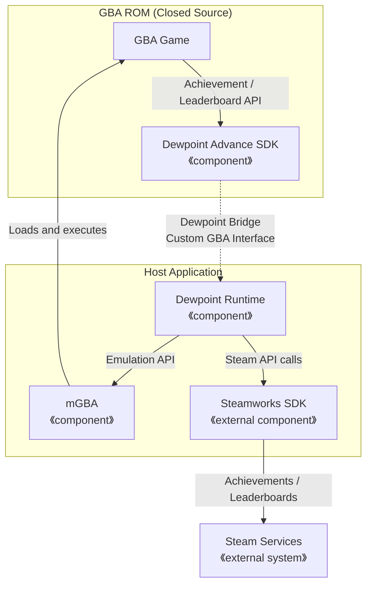

**English** / [Japanese](./README-ja.md)
---

# **WIP:** Dewpoint Advance


Dewpoint Advance (DPA) is an emulator frontend designed specifically for distributing **homebrew GBA software** on Steam.

It uses mGBA as its emulator core.

It also provides an SDK that enables GBA software to integrate with the Steamworks SDK (including Leaderboards and Achievements) and exposes interfaces for application control.

Many titles currently available on Steam run software originally developed for older consumer game consoles through emulators, and their implementations often separate the in-game experience from the UI. DPA, however, enables seamless platform integration entirely within the game. (This eliminates the need to implement an out-of-game UI, improving productivity and UX.)



Note that GBA software using this SDK's APIs cannot run on physical GBA hardware.

**This SDK is not intended to run existing GBA software.**

It is an SDK for developers and publishers who want to distribute **newly developed GBA software** easily on Steam.

**Important notes:**

- GBA, Game Boy, and Game Boy Advance are registered trademarks of Nintendo in Japan and/or other countries. If you wish to include wording such as "for XXX" in a game title, obtain permission from Nintendo. (Please note that another party's registered trademark cannot be included in a product name without authorization.)
- Do not use Game Boy or Game Boy Advance BIOS functions (such as MP2k).
- When distribution data (embedded data) is generated, any data in the Game Boy or Game Boy Advance header image over which Nintendo holds trademark or design rights is zeroed out in the ROM file.

## WIP status

- [x] macOS Runtime (run GBA games using macOS + SDL2)
- [x] Linux Runtime (run GBA games using Linux + SDL2)
- [x] Windows Runtime (run GBA games using Windows + DirectX)
- [x] SDK: Replay API for GBA (API for storing/loading replay data accessible from the GBA)
- [x] SDK: Achievement API for GBA (Achievement unlock API accessible from the GBA)
- [x] SDK: Leaderboard API for GBA (Leaderboard send/receive API accessible from the GBA)
- [x] Implement package creation procedure (Windows)
- [x] Implement package creation procedure (macOS)
- [x] Implement package creation procedure (Linux)
- [x] Review licenses
- [x] Make the repository public
- [ ] System test: Distribute Battle Marine Advance on Steam (Windows/macOS/Linux)

## How to Use

### Prerequisites

1. Enter into a Steam distribution agreement with Valve
2. Obtain the Steamworks SDK
3. Place the `public` and `redistributable_bin` directories under the [./steamworks](./steamworks/) directory

### Build for Test (macOS/Linux)

```bash
git clone https://github.com/suzukiplan/dewpoint-advance
cd dewpoint-advance
cp package.conf.model package.conf
make
```

### Build for Test (Windows)

On Windows, run the following commands in the Visual Studio **x86 Native Tools Command Prompt**.
`make.bat` builds the tools with CL/NMAKE, generates the configuration files and
`Makefile.Windows`, and then passes the remaining arguments to NMAKE.

```bat
git clone https://github.com/suzukiplan/dewpoint-advance
cd dewpoint-advance
copy package.conf.model package.conf
notepad package.conf
make.bat
```

On Windows, the test build will fail unless it can access the icon file specified in package.conf. Specify the path to a suitable icon file (a 256x256 PNG).

> On macOS, IconFile is not required until package creation. Linux does not reference IconFile.


To perform a clean build and create the distribution zip, run:

```bat
make.bat clean all
make.bat package
```

The Windows runtime uses Direct3D 9 and DirectSound 8 and does not depend on SDL2.
Runtime logs are not written to standard output. When launched through Steam, they are written to `log.txt` in the installation directory; otherwise, they are written to `log.txt` in the current directory.

### Execute

- Windows: `game.exe`
- macOS/Linux: `game`

The keyboard mappings are as follows:

- Arrow keys: D-pad
- Z: B button
- X: A button
- A: L button
- S: R button
- Esc: Select button
- Space: Start button
- macOS: ⌘+R to reset, ⌘+P to pause the hardware, and ⌘+Q to power off
- Linux: Super+R to reset, Super+P to pause the hardware, and Super+Q to power off
- Windows: Ctrl+R to reset, Ctrl+P to pause the hardware, and F11 or Alt+Enter to toggle fullscreen mode

## Dewpoint SDK

- It can be used with GBA projects created using [devkitPro](https://github.com/devkitPro/).
- Copy the files under [./sdk/](./sdk/) to your source code directory.
- Include `#include "dpa.h"` to use it.

| API | Description |
|:----|:------------|
| `dpa_is_enabled` | Check whether the Dewpoint Advance SDK is available |
| `dpa_get_app_version` | Get the application version (`AppVersion`) as a string |
| `dpa_button_a` | Character code for the A button (PC: `'X'`, XB/SW: `'A'`, PS: `'X'`) |
| `dpa_button_b` | Character code for the B button (PC: `'Z'`, XB/SW: `'B'`, PS: `'O'`) |
| `dpa_achievement_unlock` | Unlock an Achievement |
| `dpa_leaderboard_send` | Submit a score |
| `dpa_leaderboard_ready` | Check whether entries can be retrieved from a Leaderboard |
| `dpa_leaderboard_get` | Retrieve the top 100 entries from a Leaderboard |
| `dpa_leaderboard_getm` | Retrieve your own entry from a Leaderboard |
| `dpa_ugc_clear` | Clear the shared UGC buffer |
| `dpa_ugc_append` | Append 4 bytes of data to the shared UGC buffer |
| `dpa_ugc_download` | Start downloading data into the shared UGC buffer |
| `dpa_ugc_size` | Get the size of the shared UGC buffer |
| `dpa_ugc_read` | Read 4 bytes from the shared UGC buffer |
| `dpa_ugc_limit_size_set` | Set the uncompressed UGC size limit |
| `dpa_ugc_limit_size_get` | Get the uncompressed UGC size limit |
| `dpa_fullscreen_set` | Switch between fullscreen and windowed modes |
| `dpa_fullscreen_get` | Get the fullscreen/windowed mode state |
| `dpa_exit` | Terminate the process (hangs on physical hardware) |

For detailed specifications, check the implementation in [./sdk/dpa.h](./sdk/dpa.h).

> A separate [SDK](https://github.com/suzukiplan/gbasdk) useful for developing GBA software with devkitPro is also available.

## Steamworks Settings

### Steam Cloud

Under "Application" → "Steam Cloud" in Steamworks, configure the following settings:

__Steam Cloud Settings:__

- Byte quota per user: `4194304`
- Number of files allowed per user: `32`

The values above are recommendations.

- Dewpoint Advance stores up to 18 files in Steam Cloud: save.dat (SRAM/Flash/EEPROM), config.dat (window state), and 16 replay files. Setting the limit to 32 provides sufficient headroom.
- Replay data uses 4 bytes per frame. Recording 60 minutes (216,000 frames) therefore requires up to 864,000 bytes. (The Dewpoint Advance SDK's Replay API records data in native memory and does not use GBA-side RAM.)

__Steam Auto-Cloud Settings:__

- `save.dat` (SRAM/Flash/EEPROM)
  - Root: `App Install Directory`
  - Subdirectory: `save`
  - Pattern: `save.dat`
  - OS: `All OSes`
- `config.dat` (window mode, window size, window position, etc.)
  - Root: `App Install Directory`
  - Subdirectory: `save`
  - Pattern: `config.dat`
  - OS: `All OSes`

Leaderboard retry files are not included in Steam Auto-Cloud. They are stored in the per-user
local application data area provided by the OS.

### Steam Input

Under "Application" → "Steam Input" in Steamworks, configure the following settings:

- Steam Input controller support: check `Xbox`, `PlayStation`, and `Nintendo Switch`
- Steam Input default controller configuration: `Custom Configuration`
- Manifest file path: `action_manifest.vdf`

Edit package.conf as appropriate to describe the role of each Game Boy Advance button (D-pad, A, B, Start, Select, L, and R).

The Xbox, PlayStation, and Nintendo Switch buttons are mapped as follows:

| Xbox | PlayStation | Nintendo Switch | GBA          |
|:----:|:-----------:|:---------------:|:------------:|
| d-pad| d-pad       | d-pad           | d-pad        |
| A    | ×           | A               | A            |
| B    | ○           | B               | B            |
| X    | ◻︎           | X               | B            |
| Y    | △           | Y               | A            |
| Menu | Menu        | plus            | Start        |
| View | Share       | minus           | Select       |
| LB   | L1          | L               | L            |
| RB   | R1          | R               | R            |
| LT   | L2          | ZL              | L            |
| RT   | R2          | ZR              | R            |
| LS   | L3          | L3              | L            |
| RS   | R3          | R3              | R            |

### Steam Leaderboard

Under "Stats & Achievements" → "Leaderboards" in Steamworks, add the following boards:

- Name: `board0`, `board1`, `board2` ... `board15` (up to 16 boards)
  - If you use only one Leaderboard, you only need to create `board0`
- Range Around User: `0`
- Global Rank Range: `100`

All other settings are optional.

The Dewpoint Advance SDK can retrieve the top 100 ranking entries and the current user's ranking entry. (There is no interface for retrieving rankings around the current user.)

Scores submitted with `dpa_leaderboard_send` are saved locally for each board. If the network connection is lost or the application exits before submission to Steam completes, the upload is retried once for each board on the next launch.
A score with UGC is considered processed once the UGC has been attached to its Leaderboard entry.

- Retry data is stored as `board0.dat` through `board15.dat` in the application's `leaderboard-cache` directory.
- Files are available only to the same OS user and are not synchronized through Steam Auto-Cloud.
- Data associated with an identified Steam account is retried only for that account.
- If the same or a better score already exists on Steam, the data is considered processed.
- Submitting another score to the same board replaces any pending data with the new score and UGC. Call this API when the local
  high score is updated by the game.

Retry files use little-endian byte order. The first 12 bytes contain the processed flag (unprocessed: `0x00000000`; processed:
`0xFFFFFFFF`), a signed 32-bit score, and the UGC size, followed by the UGC data.
At the end is a 28-byte footer containing the format version, CRC, request ID, and Steam ID. Invalid or corrupted
files are not submitted and are quarantined as `.invalid` files.

UGC attached to Steam Leaderboard entries is encoded as a Dewpoint UGC header (Magic and format version) followed by
an LZ4 frame with block and content checksums. Downloads without the Magic are treated as legacy uncompressed UGC after
size and word-alignment validation. If the Magic is present but the header, LZ4 frame, or checksums are invalid, the data
is rejected instead of falling back to the legacy format. Because legacy data could theoretically begin with the same
Magic by chance, this identification is not mathematically perfect.

The 16-byte Dewpoint UGC header consists of the 12-byte Magic `DPA-UGC-LZ4\x1A`, a little-endian 16-bit format version
(currently `1`), and a little-endian 16-bit reserved field (currently `0`).

The hard limit for UGC is applied to the uncompressed data. It defaults to 1 MiB (`1048576` bytes) and can be changed
by the GBA application with `dpa_ugc_limit_size_set`; `dpa_ugc_limit_size_get` returns the current value. A valid limit is
a multiple of 4 from 4 through 2146435072 bytes. The setter returns the effective limit, leaves it unchanged when given
an invalid value or while a UGC operation is in progress, and clears the shared UGC buffer when the value changes. Set
the limit before appending, downloading, or submitting UGC. The selected limit is used consistently for the shared
buffer, retry files, Steam uploads, and download/decompression validation. The selected value remains in effect until
the process exits or another value is set,
so applications that use a custom value should set it during startup. A retry file larger than the current limit is
retained and deferred; it is loaded when the application sets a sufficient limit instead of being treated as corrupt.

Increasing the limit also increases the possible local storage, memory, and Steam Cloud usage. Configure the Steam Cloud
quota accordingly, and select a value supported by every target platform when porting the Runtime.

> _NOTE: This configuration is not required if your game does not use Leaderboards through the Dewpoint SDK._

The ranking range specification uses the lowest common denominator of the platform specifications known to the author as a hard limit, but this is not guaranteed.

UGC data in Dewpoint Advance (data attached to score rankings) is supported as standard on Steam, but it is not available through the network features of some consoles, such as Nintendo Switch.

When porting Dewpoint Runtime to other platforms, adjust the specifications as appropriate to comply with each platform's requirements.

### Steam Achievement

Under "Stats & Achievements" → "Achievements" in Steamworks, register each Achievement with an API name that matches the text passed to `dpa_achievement_unlock`.

## How to Create a Package

To create a package, set the distribution information in a package.conf file copied from [./package.conf.model](./package.conf.model).

| Settings | Description |
|:---------|:------------|
| `AppName` | Application name used for the window title, `.app` name, plist, and other metadata |
| `AppVersion` | Application version |
| `ExeName` | Executable filename (`.exe` is appended on Windows) |
| `IconFile` | Path to the application icon |
| `RomFile` | Path to the ROM file (`.gba`) |
| `ReleaseZip*` | Zip filename for uploading each OS build to Steamworks |
| `ButtonDesc*` | Description of each button's role (displayed in the Steam Input settings) |
| `macOS App Settings` | Settings related to notarization of the macOS application |

After completing the required configuration, run `make package` to generate the `ReleaseZip*` files.

### Windows Build Environment

- Building requires the Visual Studio Build Tools C++ toolset and the Windows SDK (including NMAKE, CL, RC, and LINK).
- The Visual Studio IDE is not used.
- Successful compilation has been verified using the Visual Studio 2022 Community and Professional command-line environments.

### macOS Build Environment

- The macOS build generates a notarized application in `.app` format.
- An Apple Developer Program membership is required for notarization.
- You must create a Keychain profile named `AC_PASSWORD`.

### Linux Build Environment (Docker)

- Due to GCC ABI compatibility, building on **the oldest practical Linux environment** is recommended.
- For Steam release builds, we recommend building in a Docker image created using the [./Dockerfile](./Dockerfile) provided in this repository.

### Recommended Repository Structure

For example, we recommend managing package.conf and your GBA project in a repository with dewpoint-advance added as a submodule, as shown below.

```
+- [dir] Your Game App (repo)
    |
    +-- [dir] dewpoint-advance (submodule)
    |
    +-- [dir] Your GBA devkitPro Project
    |
    +-- [file] package.conf
    |
    +-- [file] build.sh / build.bat (copy package.conf to dewpoint-advance, then run `cd dewpoint-advance && make package`)
```

## OSS Licenses

The Dewpoint Advance source code under [./src](./src) is licensed under the [MIT License](./LICENSE_DPA.txt), except for the bundled LZ4 source under [./src/lz4](./src/lz4). The final deliverable includes software under the following licenses:

- [mGBA](https://mgba.io/)
  - Copyright © 2013–2026 Vicki Pfau.
  - License: [Mozilla Public License Version 2.0](./LICENSE_mGBA.txt)
- [inih](https://github.com/benhoyt/inih)
  - Copyright © 2009 – 2020 Ben Hoyt
  - [License: BSD 3-clause](./LICENSE_inih.txt)
- [SDL2](https://www.libsdl.org/)
  - Copyright © 1997-2025 Sam Lantinga slouken@libsdl.org
  - License: [ZLIB](./LICENSE_SDL2.txt)
- [LZ4](https://github.com/lz4/lz4)
  - Copyright © 2011-2020 Yann Collet
  - License: [BSD 2-Clause](./LICENSE_LZ4.txt)
- [Dewpoint Advance](https://github.com/suzukiplan/dewpoint-advance)
  - Copyright © 2026 SUZUKI PLAN
  - License: [MIT](./LICENSE_DPA.txt)

Be sure to include the following information in user-accessible documentation (such as the store description):

- The application uses Dewpoint Advance
- Dewpoint Advance includes MPL 2.0-licensed code (mGBA)
- The source code disclosed under the MPL 2.0 license is available in the `suzukiplan/dewpoint-advance` repository on GitHub

**Example:**

```
## License

- This application was developed using Dewpoint Advance.
- This application includes mGBA, licensed under the Mozilla Public License 2.0 (MPL 2.0).
- The corresponding source code covered by MPL 2.0 is available in the “suzukiplan/dewpoint-advance” repository on GitHub.
```

> Because URLs cannot be included in Steam store descriptions, you must use wording such as the example above.
>
> If the store description on a platform other than Steam can include URLs, provide the exact URL ([https://github.com/suzukiplan/dewpoint-advance/](https://github.com/suzukiplan/dewpoint-advance/)).

If you need to customize the mGBA implementation itself, you must ensure full compliance with the MPL 2.0 license requirements—for example, by publicly releasing a fork of the dewpoint-advance repository that contains your custom implementation and directing users to it.
